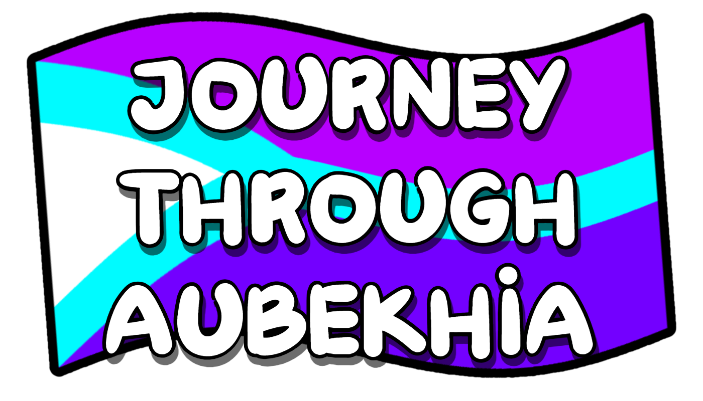

    

<h1 align="center">Journey Through Aubekhia</h1>

    <em>A silly little platformer game where you explore!</em>

    
    
    

    

> [!NOTE]
> This game is very early in development, so not everything will be final!  
> Check the [To-Do List](./TODO.md) to see what's planned.

---

# Compiling
> **Just want to play the game? Use the itch.io link above!**

If you want to build the game yourself, follow the [compilation guide](./COMPILING.md).

# Modding
If you're interested in modding the game, feel free to read the [documentation](https://joath-team.github.io/JTA)!

# Credits
| Avatar | User | Contribution(s) |
| ------ | -------- | ----------- |
|  | [Joalor64](https://github.com/Joalor64) | Creator, Main Programmer, Artist, Composer
|  | [Huy1234TH](https://github.com/khuonghoanghuy) | Additional Programmer
|  | [Infinite Kemonoyagi](https://github.com/infinite-kemonoyagi) | Minor Fixes